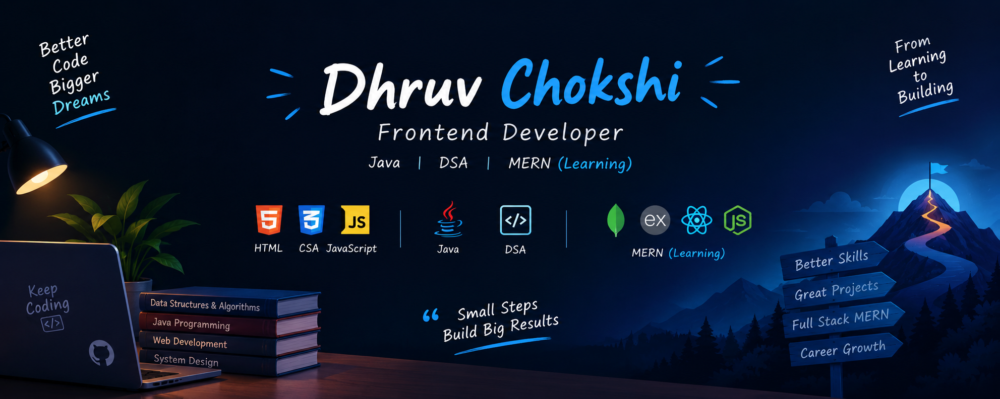

<p align="center">
  
</p>

<h1 align="center">Hi 👋, I'm Dhruv Chokshi</h1>

<h3 align="center">💻 Frontend Developer | ☕ Java & DSA | 🚀 Aspiring MERN Full Stack Developer</h3>

<p align="left">
  
</p>

---

## 👨‍💻 About Me

* 💻 I'm a **Frontend Developer** passionate about building responsive and user-friendly web applications.
* ☕ Strong foundation in **Java, Object-Oriented Programming and Problem Solving**.
* 🧠 Passionate about **Data Structures & Algorithms** and consistently solving coding problems.
* 🏆 Solved **250+ problems on LeetCode**.
* 🔧 Familiar with **Git and GitHub** for version control and project development.
* 🌱 Currently **learning Backend Development**.
* 🚀 Exploring the **MERN Stack** to become a **Full Stack Developer**.
* 📚 Continuously improving my **DSA, Java and Web Development** skills.
* 🎯 My goal is to become a strong **Full Stack MERN Developer** with solid problem-solving skills.

---

## 💻 Frontend Development

<p align="left">

<a href="https://developer.mozilla.org/en-US/docs/Web/HTML" target="_blank">

</a>

<a href="https://developer.mozilla.org/en-US/docs/Web/CSS" target="_blank">

</a>

<a href="https://developer.mozilla.org/en-US/docs/Web/JavaScript" target="_blank">

</a>

</p>

**HTML5 • CSS3 • JavaScript • Responsive Web Design**

---

## 🚀 MERN Stack — Currently Learning

<p align="left">

<a href="https://www.mongodb.com/" target="_blank">

</a>

<a href="https://expressjs.com/" target="_blank">

</a>

<a href="https://react.dev/" target="_blank">

</a>

<a href="https://nodejs.org/" target="_blank">

</a>

</p>

**MongoDB • Express.js • React.js • Node.js**

> 🌱 Currently learning **Backend Development** and working towards becoming a **Full Stack MERN Developer**.

---

## 💻 Languages

<p align="left">

<a href="https://www.java.com/" target="_blank">

</a>

<a href="https://isocpp.org/" target="_blank">

</a>

<a href="https://www.python.org/" target="_blank">

</a>

</p>

**Java • C++ • Python**

## 🧠 Data Structures & Algorithms

<p align="center">


</p>

### 📚 Topics I'm Practicing

**Arrays • Strings • Linked List • Stack • Queue • HashMap • Recursion • Sorting • Searching • Binary Search • Sliding Window • Prefix Sum**

---

## 🛠️ Tools & Platforms

<p align="left">

<a href="https://git-scm.com/" target="_blank">

</a>

<a href="https://github.com/" target="_blank">

</a>

<a href="https://code.visualstudio.com/" target="_blank">

</a>

</p>

**Git • GitHub • VS Code**

---

## 🌱 Currently Learning

<p align="center">


</p>

* 🔹 Backend Development
* 🔹 Node.js & Express.js
* 🔹 MongoDB & Database Fundamentals
* 🔹 REST APIs
* 🔹 Authentication & Authorization
* 🔹 Full Stack MERN Development

---

## 🎯 My Development Journey

```text
Frontend Development
        ↓
Java + DSA + Problem Solving
        ↓
Backend Development
        ↓
Node.js + Express.js + MongoDB
        ↓
REST APIs & Authentication
        ↓
Full Stack MERN Developer 🚀
```

---

## 🏆 Achievements

<p align="center">


</p>

---

## 📊 GitHub Stats

<p align="center">
  
</p>

<p align="center">
  
</p>

<p align="center">
  
</p>

---

## 🧩 LeetCode

<p align="center">
  <a href="https://leetcode.com/">
    
  </a>
</p>

<p align="center">
  <a href="https://leetcode.com/">
    
  </a>
</p>

---

## 🚀 Goals

* 🎯 Solve **more DSA problems** and improve problem-solving skills.
* 💻 Build strong **Frontend Development** projects.
* ⚙️ Learn **Backend Development**.
* 🚀 Build complete applications using the **MERN Stack**.
* 🧠 Strengthen **Java + DSA + OOP** fundamentals.
* 🌐 Become a **Full Stack MERN Developer**.
* 💼 Prepare for **Software Development placements**.

---

## 🤝 Connect With Me

<p align="left">

<a href="https://github.com/chokshidhruv10" target="_blank">

</a>

<a href="https://leetcode.com/" target="_blank">

</a>

</p>

---

<h3 align="center">⚡ Code. Solve. Build. Learn. Repeat. ⚡</h3>

<h4 align="center">Thanks for visiting my profile! 🚀</h4>
